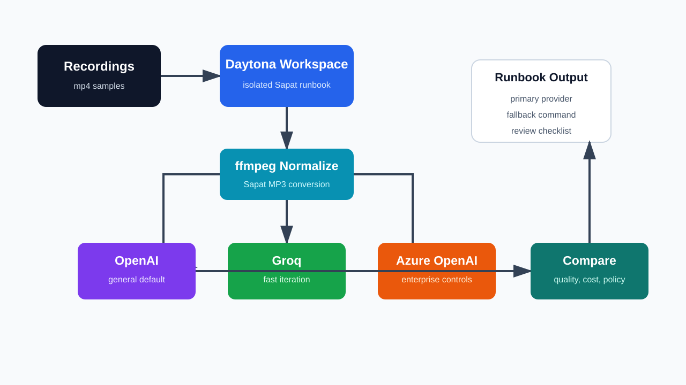

# Choose a Sapat Transcription Provider in Daytona

# Introduction

Sapat is a small Python command-line tool for turning video recordings into text. It takes an input video file or a directory of `.mp4` files, converts each recording to MP3 with `ffmpeg`, sends the audio to a transcription API, and writes a `.txt` transcript beside the original video.

The current Sapat source supports three providers through the required `--api` flag: OpenAI, Groq, and Azure OpenAI.

That provider choice is not just a setup detail. It controls which credentials you need, where audio is processed, which model names you configure, how quickly a transcript comes back, and how you recover when a provider is unavailable.

For AI engineers working with customer calls, product demos, lectures, interviews, or internal research videos, the right question is not "Which provider is best forever?" It is "Which provider should be primary for this workflow, and what is the fallback?"

This guide shows how to build that decision loop inside a [Daytona workspace](../definitions/20240819_definition_daytona%20workspace.md). You will install Sapat, configure provider credentials safely, and run the same recording through each provider.

You will also compare the outputs and document a simple failover plan that another teammate can use later.

For this guide, failover means having a tested [transcription provider failover](../definitions/20260511_definition_transcription_provider_failover.md) path before an urgent recording lands in the queue.



## TL;DR

- Use Daytona to keep the Sapat repository, dependencies, sample files, and provider credentials in a reproducible workspace.
- Use Sapat's `--api` flag to run the same recording through `openai`, `groq`, and `azure`.
- Compare providers on transcript quality, latency, file-size behavior, operational policy, and correction workflow instead of choosing by brand name.
- Keep a short failover note with the primary provider, fallback provider, required environment variables, and verification commands.

## Prerequisites

To follow along, you need:

- A GitHub account and access to Daytona.
- Python 3.6 or newer.
- `ffmpeg` available in the workspace.
- A short `.mp4` sample recording that you are allowed to send to third-party transcription providers.
- API credentials for at least one supported provider: OpenAI, Groq, or Azure OpenAI.

You do not need to commit any real API keys. Keep secrets in environment variables or a local `.env` file that is never pushed to Git.

## Step 1: Create a Daytona workspace for Sapat

Start by creating a workspace from the Sapat repository:

```bash
daytona create https://github.com/nkkko/sapat --code
```

The repository may redirect to the current Sapat home, but the project structure is small: a `pyproject.toml`, a `src/sapat` package, and provider implementations under `src/sapat/transcription`.

After the workspace opens, check the files:

```bash
python --version
python -m pip --version
ls
find src/sapat -maxdepth 3 -type f | sort
```

Sapat's source has four files worth knowing before you run anything:

| File | Why it matters |
| --- | --- |
| `src/sapat/script.py` | Defines the CLI, including `--api`, `--quality`, `--language`, `--prompt`, `--temperature`, and `--correct`. |
| `src/sapat/transcription/base.py` | Converts video to MP3 with `ffmpeg`, writes the final `.txt` file, and removes the temporary MP3. |
| `src/sapat/transcription/openai.py` | Reads OpenAI environment variables and calls the configured transcription endpoint. |
| `src/sapat/transcription/groq.py` | Uses the Groq-compatible speech-to-text endpoint and Groq chat model for correction. |
| `src/sapat/transcription/azure.py` | Uses Azure OpenAI deployment settings for transcription and correction. |

That quick map prevents a common mistake: testing only the happy-path command without understanding which provider-specific variables Sapat expects.

## Step 2: Install Sapat and ffmpeg

Install the package in editable mode so the `sapat` command is available inside the workspace:

```bash
python -m pip install --upgrade pip
python -m pip install -e .
sapat --help
```

Then confirm `ffmpeg` is installed:

```bash
ffmpeg -version
```

If your workspace does not have `ffmpeg`, install it with the package manager available in your Daytona target. On Debian or Ubuntu based images, that is usually:

```bash
sudo apt-get update
sudo apt-get install -y ffmpeg
```

Sapat converts each input video to an MP3 before sending audio to the provider. If `ffmpeg` is missing, the provider credentials can be perfect and the run will still fail before the API call.

## Step 3: Store provider credentials without committing them

Sapat loads provider settings from `.env`, so create one locally:

```bash
cp .env.example .env 2>/dev/null || touch .env
```

Then add only the providers you plan to test. For OpenAI:

```bash
OPENAI_API_KEY=your_openai_key
OPENAI_MODEL=whisper-1
OPENAI_API_ENDPOINT=https://api.openai.com/v1/audio/transcriptions
OPENAI_MODEL_NAME_CHAT=gpt-4o
```

For Groq:

```bash
GROQCLOUD_API_KEY=your_groq_key
GROQCLOUD_MODEL=whisper-large-v3-turbo
GROQCLOUD_API_ENDPOINT=https://api.groq.com/openai/v1/audio/transcriptions
GROQCLOUD_MODEL_NAME_CHAT=llama3-8b-8192
```

For Azure OpenAI:

```bash
AZURE_OPENAI_API_KEY=your_azure_key
AZURE_OPENAI_ENDPOINT=https://your-resource.openai.azure.com
AZURE_OPENAI_DEPLOYMENT_NAME_WHISPER=whisper
AZURE_OPENAI_API_VERSION_WHISPER=2024-06-01
AZURE_OPENAI_DEPLOYMENT_NAME_CHAT=gpt-4o
AZURE_OPENAI_API_VERSION_CHAT=2023-03-15-preview
```

Keep `.env` local. If the repository does not already ignore `.env`, add it to your personal global Git ignore or keep credentials in exported shell variables instead:

```bash
export OPENAI_API_KEY=your_openai_key
export OPENAI_MODEL=whisper-1
export OPENAI_API_ENDPOINT=https://api.openai.com/v1/audio/transcriptions
export OPENAI_MODEL_NAME_CHAT=gpt-4o
```

The decision loop in this guide works with one provider, but it becomes more useful when you can test two or three under the same workspace conditions.

## Step 4: Prepare a small provider test set

Use a short sample first. A 30 to 90 second clip is enough to compare basic behavior without wasting credits or waiting on long uploads.

Create a test directory:

```bash
mkdir -p samples/provider-test transcripts
cp /path/to/your-demo.mp4 samples/provider-test/demo.mp4
```

Pick a clip that includes the kind of speech your real workflow uses. For example:

- A product demo with technical terms and acronyms.
- A meeting excerpt with two speakers.
- A lecture clip with domain vocabulary.
- A noisy recording if your real input often has background sound.

Sapat currently writes the transcript next to the source video. To keep provider results separate, copy the sample before each run or rename the output after each run.

## Step 5: Run the same recording with each provider

Start with OpenAI:

```bash
sapat samples/provider-test/demo.mp4 \
  --api openai \
  --quality M \
  --language en \
  --prompt "Technical product demo with names, commands, and API terminology." \
  --temperature 0

mv samples/provider-test/demo.txt transcripts/demo.openai.txt
```

Run Groq with the same clip and options:

```bash
sapat samples/provider-test/demo.mp4 \
  --api groq \
  --quality M \
  --language en \
  --prompt "Technical product demo with names, commands, and API terminology." \
  --temperature 0

mv samples/provider-test/demo.txt transcripts/demo.groq.txt
```

Run Azure OpenAI if your deployment is configured:

```bash
sapat samples/provider-test/demo.mp4 \
  --api azure \
  --quality M \
  --language en \
  --prompt "Technical product demo with names, commands, and API terminology." \
  --temperature 0

mv samples/provider-test/demo.txt transcripts/demo.azure.txt
```

Use `--quality M` for the first pass. In Sapat's base converter, low quality uses mono 22.05 kHz audio at 96k, medium uses mono 44.1 kHz at 96k, and high uses stereo 44.1 kHz at 192k.

Medium is a practical default for provider comparisons because it avoids oversized files while preserving enough detail for normal speech.

## Step 6: Compare output with a small manifest

Create a manifest file so the provider decision is not trapped in terminal history:

```bash
cat > transcripts/provider-comparison.md <<'EOF'
# Sapat Provider Comparison

Sample: `samples/provider-test/demo.mp4`
Date:
Prompt:
Quality: M
Language: en

| Provider | Command worked? | Transcript file | Notes |
| --- | --- | --- | --- |
| OpenAI |  | `transcripts/demo.openai.txt` |  |
| Groq |  | `transcripts/demo.groq.txt` |  |
| Azure OpenAI |  | `transcripts/demo.azure.txt` |  |

## Review checklist

- Were product names and acronyms preserved?
- Did the transcript invent words that were not spoken?
- Did punctuation help readability without changing meaning?
- Did the provider handle background noise?
- Was latency acceptable for this workflow?
- Did the result meet policy, privacy, and region requirements?

## Decision

Primary provider:
Fallback provider:
When to switch:
EOF
```

Then review the files side by side:

```bash
wc -w transcripts/demo.*.txt
diff -u transcripts/demo.openai.txt transcripts/demo.groq.txt | sed -n '1,120p'
```

You are not looking for a perfect word-for-word winner. You are looking for a provider that consistently handles your content type. A provider that is excellent on clean narration may be weaker on meeting cross-talk.

A provider that is fast enough for daily demos may not fit regulated customer recordings. The manifest makes those tradeoffs explicit.

## Step 7: Decide when to use `--correct`

Sapat has a `--correct` flag that sends the transcript through a chat model for cleanup. This can be useful for punctuation, capitalization, and product spelling, but it is a second model call. Treat it as an editing stage, not as proof that the transcript is correct.

Run one corrected pass on your chosen primary provider:

```bash
sapat samples/provider-test/demo.mp4 \
  --api openai \
  --quality M \
  --language en \
  --prompt "Preserve API names, CLI commands, product names, and speaker intent." \
  --temperature 0 \
  --correct

mv samples/provider-test/demo.txt transcripts/demo.openai.corrected.txt
```

Compare the corrected output to the raw output:

```bash
diff -u transcripts/demo.openai.txt transcripts/demo.openai.corrected.txt | sed -n '1,160p'
```

Use correction when it improves readability without adding unsupported claims. Avoid it for legal, medical, compliance, or customer-facing records unless a human review step remains part of the workflow.

## Step 8: Write the failover runbook

Create a short runbook that tells another engineer what to do when the primary provider fails:

```bash
cat > transcripts/sapat-failover-runbook.md <<'EOF'
# Sapat Failover Runbook

## Primary path

Provider:
Command:
Required environment variables:

## Fallback path

Provider:
Command:
Required environment variables:

## Switch when

- The primary provider returns an authentication or quota error.
- The transcript misses domain terms that the fallback handles better.
- The recording must run in a provider approved for this customer's policy.
- File size, latency, or service availability blocks the primary path.

## Verification

- Confirm the `.txt` file was created.
- Compare word count against the expected recording length.
- Read the first and last paragraphs.
- Check product names, speaker names, numbers, dates, and commands.
- Record the final provider in `provider-comparison.md`.
EOF
```

This runbook is intentionally simple. The value is not the template itself; the value is that the next person does not need to rediscover your provider choice under deadline pressure.

## Common Issues and Troubleshooting

**Problem:** `sapat --help` is not found.

**Solution:** Install the project in editable mode with `python -m pip install -e .`. If your shell still cannot find the script, run `python -m sapat.script --help` to confirm the package imports correctly.

**Problem:** `ffmpeg` fails before the provider API is called.

**Solution:** Run `ffmpeg -version` and install it in the workspace. Sapat depends on `ffmpeg` for MP3 conversion before transcription.

**Problem:** The provider returns an authentication error.

**Solution:** Check the exact environment variables Sapat expects. For example, Groq uses `GROQCLOUD_API_KEY`, while OpenAI uses `OPENAI_API_KEY`. A valid key under the wrong variable name is still invisible to Sapat.

**Problem:** Azure OpenAI fails even though the API key is valid.

**Solution:** Verify the endpoint, deployment name, and API version variables. Azure OpenAI transcription depends on deployment-specific values, not only a global API key.

**Problem:** The transcript misses product names.

**Solution:** Rerun with a more specific `--prompt`, then compare the result. Keep prompts factual and short: product names, acronyms, speaker context, and expected vocabulary.

**Problem:** The transcript is readable but not trustworthy enough to share.

**Solution:** Add a human review gate. For important recordings, the workflow should produce a draft transcript plus a checklist, not an automatic final document.

## Provider Selection Checklist

Use this table when choosing a default:

| Question | Why it matters |
| --- | --- |
| Which provider gives the best transcript on your real sample? | Accuracy depends on audio quality, vocabulary, accents, and noise. |
| Which provider has an acceptable latency for the workflow? | A daily product-demo workflow has different timing needs than an overnight archive job. |
| Which provider is approved for this data? | Customer recordings may require regional, contractual, or enterprise controls. |
| Which provider has a clear fallback command? | A fallback that nobody has tested is only a hope, not a runbook. |
| Does `--correct` improve or distort the transcript? | Correction can polish text, but it can also hide transcription uncertainty. |

## Conclusion

Sapat makes provider switching a command-line option, but a reliable transcription workflow needs more than a flag. By running OpenAI, Groq, and Azure OpenAI from the same Daytona workspace, you can compare providers under the same dependencies, the same sample files, and the same prompts.

The end result should be a small operational decision: primary provider, fallback provider, credentials required, and a review checklist.

That is enough to turn Sapat from a one-off transcription script into a repeatable workflow for AI engineers who need transcripts they can inspect, reproduce, and hand off.

## References

- [Sapat GitHub repository](https://github.com/nkkko/sapat)
- [Daytona documentation](https://www.daytona.io/docs/)
- [Daytona environment configuration](https://www.daytona.io/docs/configuration)
- [OpenAI speech-to-text guide](https://developers.openai.com/api/docs/guides/speech-to-text)
- [Groq speech-to-text documentation](https://console.groq.com/docs/speech-to-text)
- [Azure OpenAI audio models guide](https://learn.microsoft.com/azure/ai-services/openai/concepts/audio)
